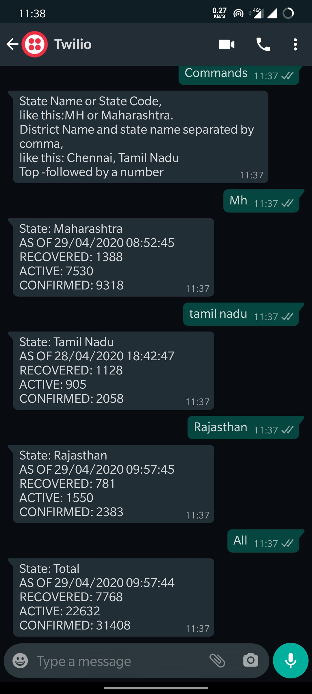
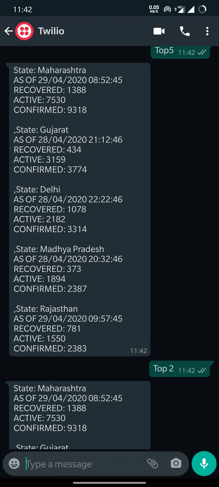
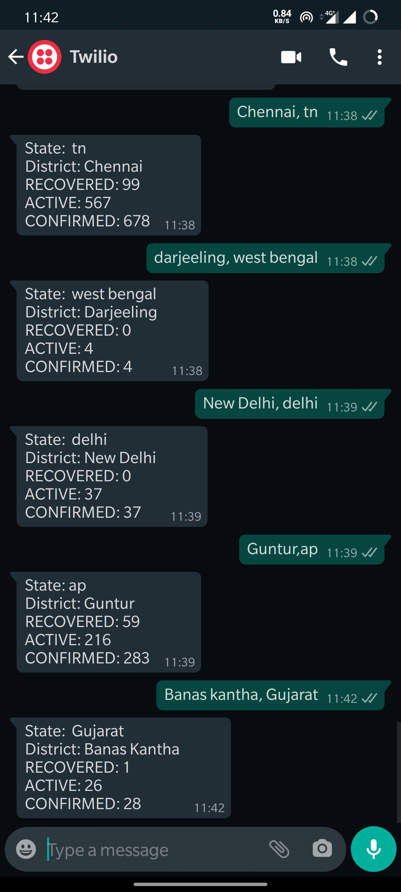

Get Covid Stats from WhatsApp

https://wa.me/14155238886?text=join%20forest-manner

API: <a href="https://api.covid19india.org/">Covid19India.org</a>

<a href="https://www.twilio.com/">Twilio</a>

Available Commands:

<li>Full State name or State Code(Both Case insensitive) to get that state stats</li>
<li>All, India to get entire Country Stats</li>
<li>District, State name or state code separated by comma</li>
<li>Top followed by a number</li>
 

Screenshots

